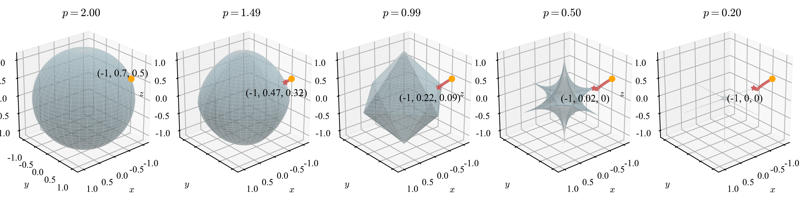
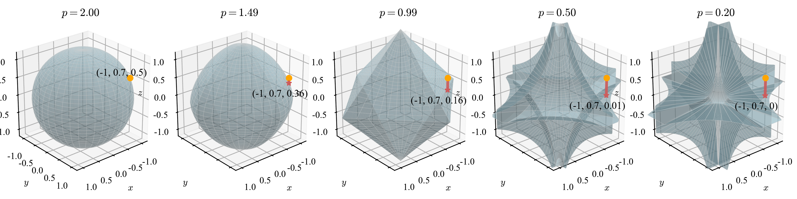
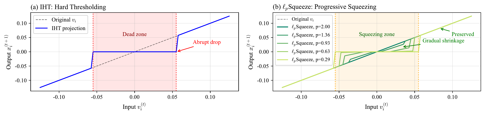
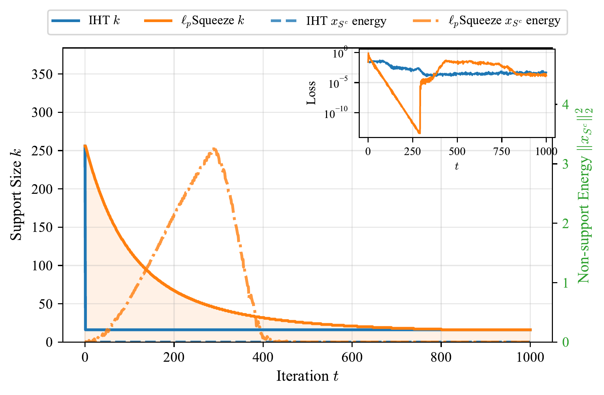
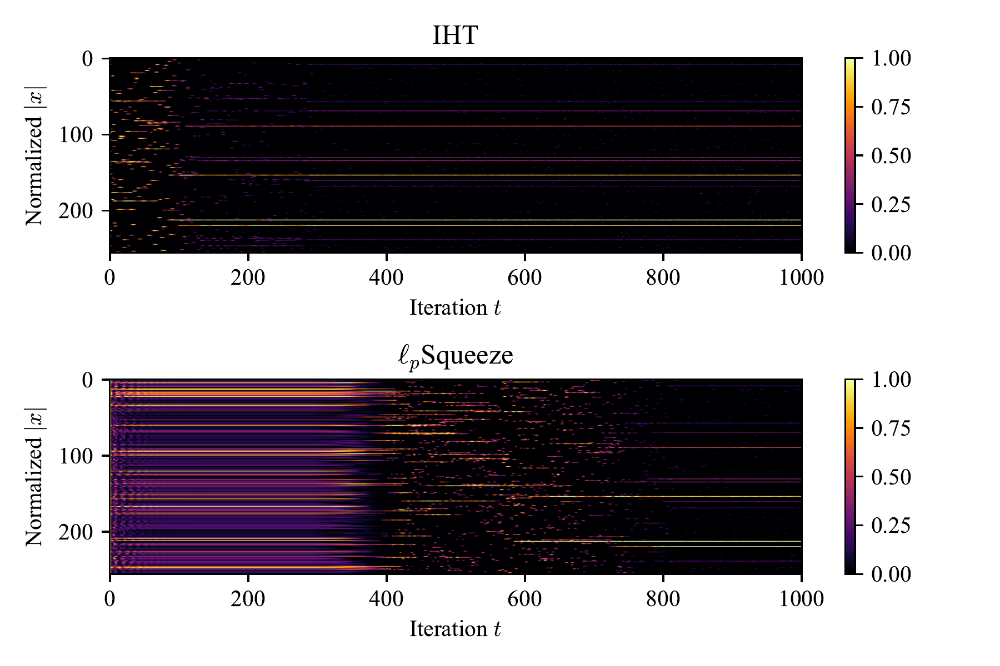
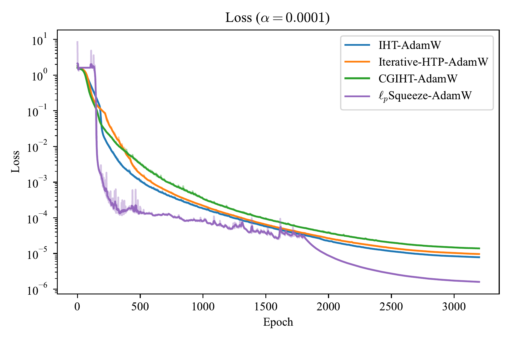

# $\ell_p$ Squeeze: Gradual Sparsification via $\ell_p$-Norm Budget

[](https://github.com/WilliamLiPro/lp-squeeze)

This repository contains the official implementation of **$\ell_p$ Squeeze**, a novel sparse optimization method that replaces the hard $\ell_0$ constraint with a soft $\ell_p$-norm budget for gradual sparsification.

---

## Overview

Sparse optimization is fundamental to compressed sensing, feature selection, and sparse neural networks. Iterative Hard Thresholding (IHT) enforces sparsity via a discontinuous projection that abruptly zeros out small entries, risking premature discarding of significant components.

**$\ell_p$ Squeeze** mitigates this by:

- Replacing the $\ell_0$ constraint with an explicit $\ell_p$-norm budget
- Gradually decreasing $p \to 0_+$ while shrinking the support size
- Progressively evolving the feasible region toward sparse subspaces
- Compressing (rather than zeroing out) non-support entries, allowing them to re-enter the support set in later iterations

On cardinality-constrained least squares where closed-form subproblem solutions exist, $\ell_p$ Squeeze performs comparably to IHT; on **TCGA pan-cancer classification** and **sparse ViT-B/16 training on ImageNet-1K**, it exceeds IHT and its variants with faster convergence and higher accuracy, surpassing existing state-of-the-art approaches.

---

## Key Mechanism

### $\ell_p$-Norm Budget Evolution

As $p$ decreases from $2$ to $0_+$, the feasible region progressively converges toward sparse subspaces:

<p align="center">
  
</p>

<p align="center">
  
</p>

<p align="center"> Evolution of the feasible set and typical $x$ as $p$ decreases from $2$ to $0_+$. 
(top) $k=1$: the feasible set converges progressively toward the coordinate axes, and $x$ approaches $\|x\|_0=1$. 
(bottom) $k=2$: the feasible set converges progressively toward the three coordinate planes, and $x$ approaches $\|x\|_0=2$.</p>


| $k=1$ | $k=2$ |
|:-----:|:-----:|
| Feasible set converges toward coordinate axes; $x$ approaches $\|x\|_0 = 1$ | Feasible set converges toward coordinate planes; $x$ approaches $\|x\|_0 = 2$ |

### Soft Squeezing vs. Hard Thresholding

<p align="center">
  
</p>

<p align="center"> Comparison of hard thresholding and soft squeezing. 
(a) Hard Thresholding: non-support entries within dead zone (red) are immediately zeroed out. 
(b) Soft Squeezing: non-support entries in the squeezing zone (orange) are progressively compressed rather than zeroed out. As $p \to 0_+$, the squeezing operator asymptotically recovers the hard thresholding.</p>

| | Hard Thresholding (IHT) | Soft Squeezing ($\ell_p$ Squeeze) |
|:---|:---|:---|
| **Small entries** | Immediately zeroed out (dead zone) | Progressively compressed (squeezing zone) |
| **Information loss** | Irreversible | Preserved for potential recovery |
| **Support update** | Stagnation until entry hits zero | Continuous refinement |
| **Limit behavior** | — | Recovers hard thresholding as $p \to 0_+$ |

---

## Algorithm Behavior: $\ell_p$Squeeze vs. IHT

<p align="center">
  
  
</p>

<p align="center"> Comparison of $\ell_p$Squeeze and IHT. 
(left) Support size and non-support energy: $\ell_p$Squeeze (orange) exhibits a gradual decay in support size and a smooth variation in non-support energy, whereas IHT (blue) enforces a fixed support size and immediately zeros out all non-support energy after the first hard-thresholding projection. 
(right) Normalized absolute weights: IHT updates the support set only when an existing entry decays to nearby zero, causing prolonged stagnation of support set; $\ell_p$Squeeze replaces a support entry once it falls below the largest non-support entry, enabling continuous refinement.</p>

## Experiments

### TCGA Pan-Cancer Classification

We evaluate $\ell_p$ Squeeze on the TCGA Pan-Cancer dataset under varying sparsity levels $\alpha$.

<p align="center">
  
</p>

<p align="center"> Convergence curves for varying target non-zero ratios on the TCGA Pan-Cancer classification. (left) $\alpha = 1\times10^{-4}$, (right) $\alpha = 2.5\times10^{-4}$.</p>

**Convergence Curves:**

| $\alpha = 1\times10^{-4}$ | $\alpha = 2.5\times10^{-4}$ |
|:--:|:--:|
| Faster convergence vs. IHT variants | Faster convergence vs. IHT variants |

**Final Loss Comparison:**

| Method | $\alpha = 8\times10^{-4}$ | $5\times10^{-4}$ | $2.5\times10^{-4}$ | $1\times10^{-4}$ |
|:---|:---:|:---:|:---:|:---:|
| IHT-AdamW | 1.29e-06 | 5.29e-06 | 3.99e-06 | 7.84e-06 |
| Iterative-HTP-AdamW | 1.29e-06 | 3.95e-06 | 6.14e-06 | 9.65e-06 |
| CGIHT-AdamW | 1.35e-06 | 3.49e-06 | 6.21e-06 | 1.39e-05 |
| FISTA | 1.61e+00 | 1.61e+00 | 1.61e+00 | 1.61e+00 |
| **$\ell_p$ Squeeze-AdamW** | **2.44e-07** | **6.01e-08** | **1.63e-06** | **1.60e-06** |

$\ell_p$ Squeeze-AdamW achieves the **lowest loss across all sparsity levels**.

---

## Citation

If you find this work useful, please consider citing:

```bibtex
@article{li2026lp,
  title={$\ell_p$Squeeze: Gradual Sparsification via $\ell_p$-Norm Budget},
  author={Weipeng Li and Xiaogang Yang},
  journal={Proceedings of 2026 CAAI International Conference on Artificial Intelligence},
  year={2026}
}
